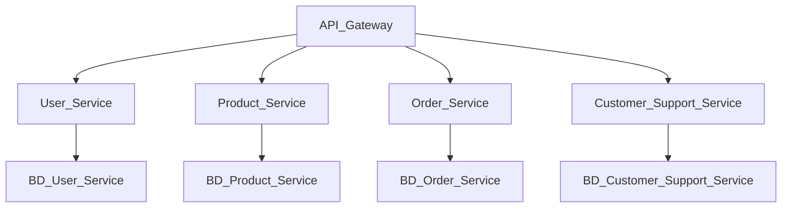

## Esquema

Cada función principal se separa en microservicios específicos: `User Service` maneja perfiles y preferencias, `Product Service` gestiona el catálogo y niveles de inventario, `Order Service` controla carritos, pagos e historial de pedidos, y `Customer Support Service` lleva consultas y tickets de soporte. Los servicios interactúan a través de APIs y colas de mensajes para sincronizarse correctamente.

En lugar de una sola base de datos relacional, cada microservicio tiene su propia base de datos según sus necesidades, como una base SQL para pedidos e inventarios,y una base de datos NoSQL para perfiles y catálogos. Esto mejora la escalabilidad y reduce los puntos únicos de fallo.

Esta migración requiere desacoplar dependencias del monolito, garantizar consistencia de datos entre servicios y optimizar para latencia y escalabilidad en un entorno distribuido
