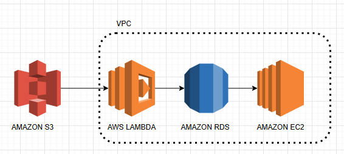

### Part 1: Designing Cloud Infrastructure

### Part 2: IAM Configuration
En esta arquitectura sencilla con VPC, Amazon S3, AWS Lambda, Amazon RDS y Amazon EC2, cada componente necesita permisos específicos para interactuar de manera segura y eficiente. También es importante asignar roles a los usuarios (como desarrolladores y administradores).
### Part 3: Resource Management Strategy
Usa Auto Scaling para ajustar automáticamente las instancias EC2 según la demanda. Implementa un Elastic Load Balancer (ELB) para distribuir tráfico y mejorar la disponibilidad. Optimiza costos con AWS Budgets, configurando alertas para evitar excedentes y usando instancias reservadas o spot. Apaga recursos no utilizados y monitorea con CloudWatch para eficiencia continua.
### Part 4: Theoretical Implementation
La aplicación usa S3 para almacenar archivos estáticos. Lambda procesa solicitudes y conecta con RDS para manejar datos. EC2 ejecuta la aplicación principal dentro de la VPC, asegurando privacidad. El flujo: usuarios acceden a S3 y Lambda, Lambda interactúa con RDS, y EC2 gestiona tareas complejas, todo integrado en una red segura.
### Part 5: Discussion and Evaluation
La arquitectura usa VPC para seguridad de red, S3 para archivos estáticos, Lambda para lógica sin servidores, RDS para bases de datos escalables y EC2 para procesamiento. Las políticas IAM limitan permisos según roles, protegiendo recursos. Con autoescalado y monitoreo, se asegura escalabilidad, costo-eficiencia y resiliencia, alineando teoría y práctica para soluciones en la nube seguras y robustas.